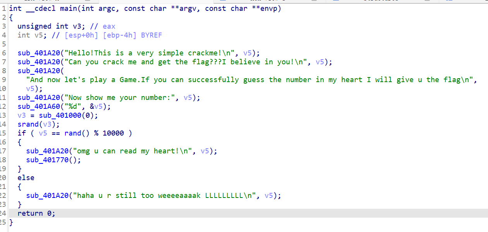
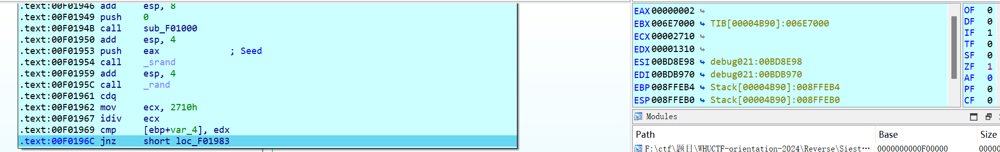
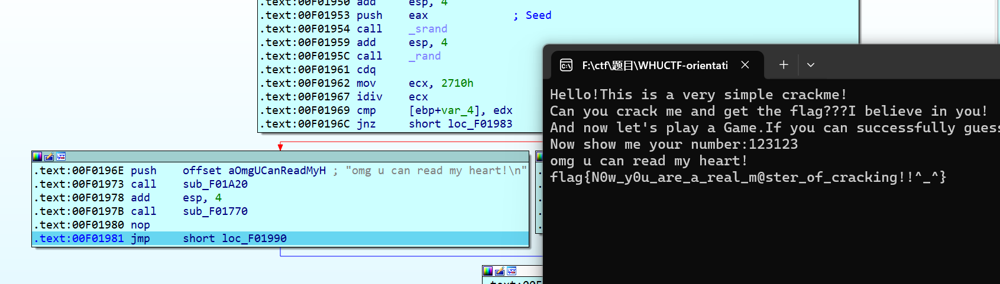

# Siesta's Revenge!

## 题目描述

在招新的时候，Siesta展示010破解失败了。一气之下他发誓要出一个全世界都能破解的软件，那么你能成功破解获得flag吗？
hint：觉得算法太复杂的话可以尝试动调或者patch

## flag

flag{N0w_y0u_are_a_real_m@ster_of_cracking!!^_^}

## wp

拖进ida，看到是一个猜数游戏，猜对数字就会执行401770函数

分析401770函数，发现逻辑相对复杂（其实实际上就是魔改了sbox的aes解密，解密完之后就会输出flag），这时候考虑直接执行401770函数，可以通过set ip或者直接patch掉判断部分或者在动态调试的时候修改zf的值。

运行到f0196c后修改zf寄存器的值为1，然后一路运行即可得到flag

