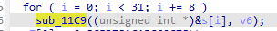
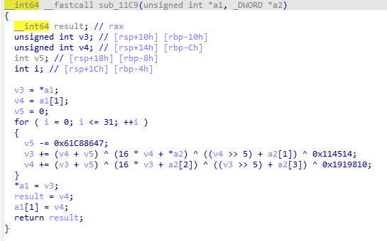

# a_cup_of_tea

## 题目描述

打ctf这么累，喝杯茶休息一下吧

## flag

flag{let's_hav3_A_cup_0f_T3A!!}

## wp

主要加密函数



很明显是tea算法，其中a1是输入的字符串，a2是tea加密的key，加密部分在原版tea的基础上异或了0x114514和0x1919810，解密的时候再异或一次就好了



```cpp
#include <stdio.h>
#include <string.h>
#define DELTA 0x9e3779b9

void tea_encrypt(unsigned int* text, unsigned int* key)
{
    unsigned int v0 = text[0];
    unsigned int v1 = text[1];
    unsigned int sum = 0;
    for (int i = 0;i < 32;i++)
    {
        sum += DELTA;
        v0 += ((v1 << 4) + key[0]) ^ (v1 + sum) ^ ((v1 >> 5) + key[1]);
        v1 += ((v0 << 4) + key[2]) ^ (v0 + sum) ^ ((v0 >> 5) + key[3]);
    }
    text[0] = v0;
    text[1] = v1;
}

void tea_decrypt(unsigned int* text, unsigned int* key)
{
    unsigned int v0 = text[0];
    unsigned int v1 = text[1];
    unsigned int sum = 0xC6EF3720;
    for (int i = 0;i < 32;i++)
    {
        v1 -= ((v0 << 4) + key[2]) ^ (v0 + sum) ^ ((v0 >> 5) + key[3]) ^ 0x1919810;
        v0 -= ((v1 << 4) + key[0]) ^ (v1 + sum) ^ ((v1 >> 5) + key[1]) ^ 0x114514;
        sum -= DELTA;
    }
    text[0] = v0;
    text[1] = v1;
}

int main()
{
    char text_byte[] = { 0x78,0x2c,0xc6,0xa5,0x1c,0x78,0x5d,0x8c,0xeb,0xaa,0xd4,0x8d,0x3c,0x31,0xef,0xae,0xa8,0xaa,0x14,0x2c,0xd8,0x6f,0x8,0xd2,0x20,0x62,0xe1,0xd0,0x68,0xad,0x3a,0xd8 };
    char key_byte[] = "SiestazzSiestazz";
    unsigned int* text = (unsigned int*)text_byte;
    unsigned int* key = (unsigned int*)key_byte;
    int n = sizeof(text_byte) / 4;

//	for (int i=0;i<n;i+=2)
//		tea_encrypt(&text[i],key);

    for (int i = 0;i < n;i += 2)
        tea_decrypt(&text[i], key);

    char* byte = (char*)text;
    for (int i = 0;i < n * 4;i++)
        printf("%c", (unsigned char)byte[i]);

    return 0;
}

```
