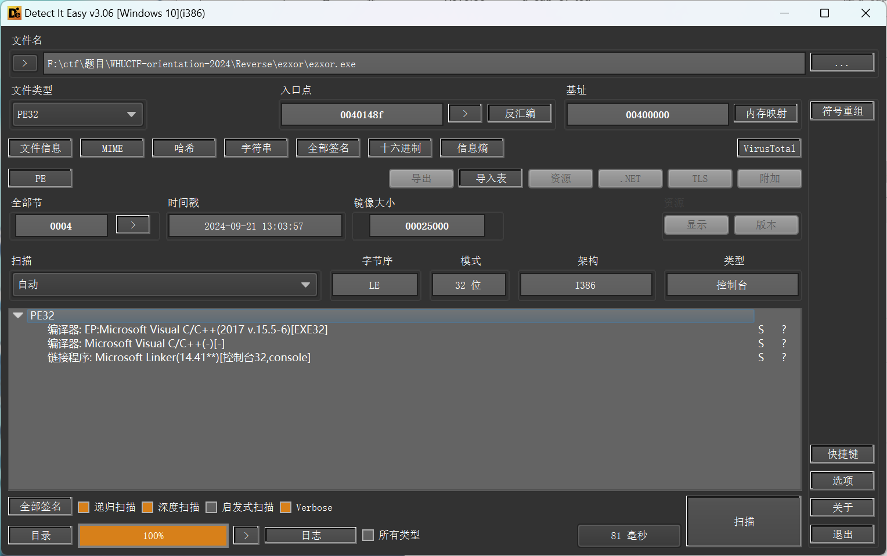
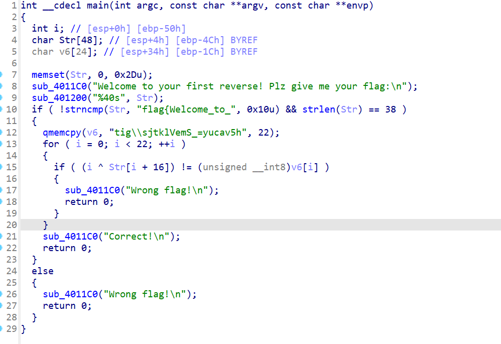

# ezxor

## 题目描述

签到题^_^

## flag

flag{Welcome_to_the_world_of_R3verse!}

## wp

将exe拖到die里查看，发现是32位的程序



将exe拖入ida32中，按f5反编译得到伪代码，可以看到flag的前0x10位已经得到，且flag的长度为38，并对后半部分进行了异或加密。由于一个数异或两次同一个数后不变，所以我们将密文再异或一次即可得到flag的后半部分。



```
#include <stdio.h>
#include <string.h>

int main()
{
    char flag1[] = "flag{Welcome_to_";
    char flag2[] = "tig\\sjtklVemS_=yucav5h";
    for (int i = 0;i < strlen(flag2);i++)
    {
        flag2[i] = flag2[i] ^ i;
    }
    printf("%s%s", flag1, flag2);
    return 0;
}

```
