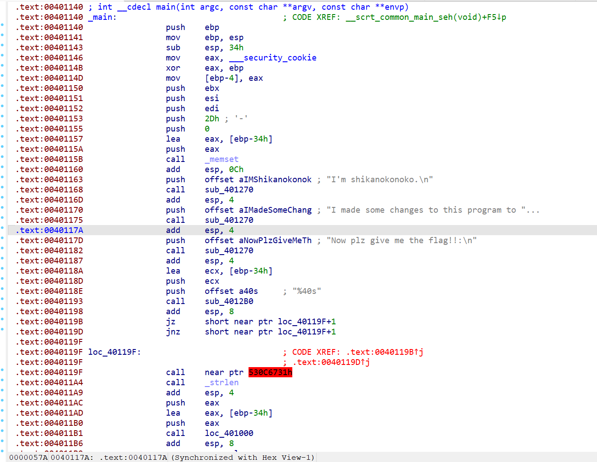
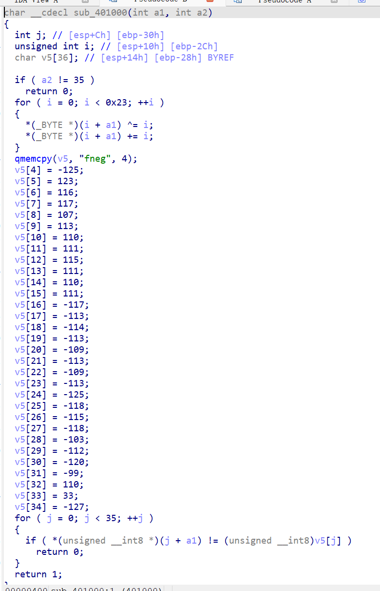

# nokotan

## 题目描述

しかのこのこのここしたんたん

## flag

flag{shikanokonokonokokoshitantan!}

## wp

拖入ida中，发现一片飘红，按f5也无法反编译，明显花指令



注意到下面CODE XREF处爆红，可以看到这里的call    near ptr 530C6731h明显不对劲。注意上面的jz和jnz语句最终跳转的目标地址都是40119f+1，即4011a0。那我们在40119f处按u（将指令转为数据），然后在4011a0处按c（重新反汇编），并将40119f处的0xe8字节修改为0x90后，再选中整个main函数按p（重新定义函数），再按f5即可反编译。

反编译后进入401000函数，仍然是同样的花指令，用同样的方法去除即可。



发现对传入的字符串进行了先异或i再+i的操作，那么解密就先减去i再异或i即可

```cpp
#include <stdio.h>
#include <string.h>

int main()
{
    unsigned __int8 enc[] = { 0x66,0x6e,0x65,0x67,0x83,0x7b,0x74,0x75,0x6b,0x71,0x6e,0x6f,0x73,0x6f,0x6e,0x6f,0x8b,0x8f,0x8e,0x8f,0x93,0x8f,0x93,0x8f,0x83,0x8a,0x8d,0x8a,0x99,0x90,0x88,0x9d,0x6e,0x21,0x81,0 };
    for (int i = 0;i < 35;i++)
    {
        enc[i] -= i;
        enc[i] ^= i;
    }
    printf("%s\n", enc);
    return 0;
}

```
