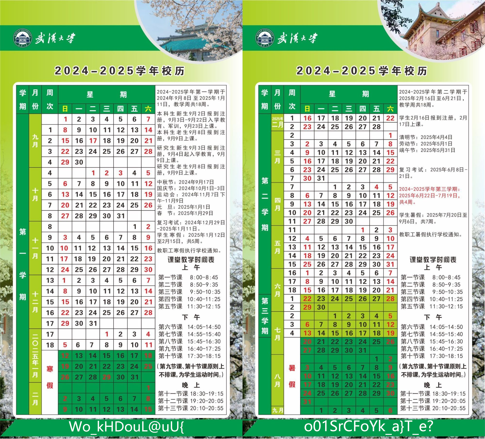

# 武大校历
`WHUCTF{Doooo_Y0u_L1ke_S@kura?}`
## 题目描述
裁断的校历出自何人的刀笔，整齐的日期铭刻何时的相遇？

凭**栏**处看樱花下落的秒速**5**厘米，总有人在绿肥红瘦中等你。

(必须使用附件中的校历图片)

### 解题过程
png 修改高度IHDR值，040F改为070F，得到原高度图片

底部绿色部分(*绿肥红瘦*)存在密文，以5为距进行栅栏解密即可(*凭栏处*)

[cyberchef解密](https://gchq.github.io/CyberChef/#recipe=Rail_Fence_Cipher_Decode(5,0)&input=V29fa0hEb3VMQHVVe28wMVNyQ0ZvWWtfYX1UX2U/)

## 出题说明
- png宽高隐写
- 栅栏加密

提示都在题目描述里说得差不多了,5个一栏的栅栏密码很明显了。

